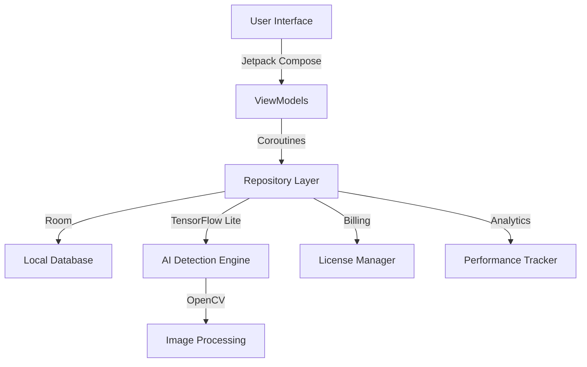

<div align="center">

# QuantraVision

### 🚀 Advanced AI Pattern Detection for Traders

*The world's most comprehensive offline trading pattern recognition system with predictive intelligence, gamification, and explainable AI*

[](https://github.com/yourusername/quantravision)
[-3DDC84?logo=android&logoColor=white)](https://developer.android.com/)
[](https://kotlinlang.org/)
[](LICENSE)
[](PRIVACY.md)
[](CONTRIBUTING.md)

[Features](#-features) • [Tech Stack](#-tech-stack) • [Download](#-download) • [Pricing](#-pricing) • [Docs](#-documentation)

---

<p align="center">
  
  
  
</p>

</div>

---

## 🎯 Overview

**QuantraVision** is a revolutionary Android application that brings institutional-grade pattern recognition to retail traders. Powered by TensorFlow Lite and OpenCV, it detects 108 unique chart patterns with **predictive intelligence** that shows patterns *before* they complete.

### Why QuantraVision?

- **🔮 See the Future**: Detect patterns at 40-85% formation stages
- **🧠 Explainable AI**: Full audit trail showing *why* each pattern was detected
- **🔒 Privacy First**: 100% offline - your data never leaves your device
- **💰 One-Time Purchase**: No subscriptions, no hidden fees
- **🎮 Gamified Learning**: 25-lesson course + achievements system
- **🎤 Voice Control**: 16 hands-free commands for multi-monitor setups

---

## ✨ Features

<table>
<tr>
<td width="50%">

### 🔮 Predictive Detection
- **Early pattern recognition** (40-85% formation)
- Formation velocity tracking
- Estimated completion time
- Trading advantage through foresight

### 🤖 Explainable AI
- Complete detection audit trail
- Factor breakdown (confidence, consensus, temporal)
- Understand AI reasoning
- Build trust through transparency

### 🎮 Gamification System
- 15 progressive achievements
- Daily streak tracking
- Bonus highlights for engagement
- Milestone rewards

</td>
<td width="50%">

### 📊 Professional Analytics
- Pattern performance tracking
- Hot patterns with trend indicators
- 30-day confidence trend analysis
- Actionable insights dashboard

### 🛠️ Advanced Tools
- **Smart Watchlist** with confluence alerts
- **PDF Report Generator** (watermark-free Pro)
- **Backtesting Engine** with CSV import
- **Multi-Chart Comparison** for correlation
- **Pattern Similarity Search**

### 🎓 Interactive Education
- 25 comprehensive lessons
- Quizzes with detailed explanations
- Certificate of completion
- From fundamentals to harmonics

</td>
</tr>
</table>

---

## 🎬 Demo

<div align="center">

### Screenshots

<table>
<tr>
<td><br/><sub><b>Dashboard</b></sub></td>
<td><br/><sub><b>Live Detection</b></sub></td>
<td><br/><sub><b>Analytics</b></sub></td>
<td><br/><sub><b>Education</b></sub></td>
</tr>
</table>

> 📸 *Screenshots coming soon - app in active development*

</div>

---

## 🏗️ Tech Stack

<div align="center">

### Core Technologies

[](https://kotlinlang.org/)
[](https://developer.android.com/jetpack/compose)
[](https://www.tensorflow.org/lite)
[](https://opencv.org/)

### Build System

[](https://gradle.org/)
[](https://developer.android.com/studio/releases/gradle-plugin)
[](https://github.com/google/ksp)

### Key Libraries

| Component | Version | Purpose |
|-----------|---------|---------|
| **Material 3** | 1.3.1 | Modern UI design system |
| **Room Database** | 2.6.1 | Local data persistence |
| **CameraX** | 1.5.0 | Camera capture & processing |
| **Coroutines** | 1.10.1 | Asynchronous operations |
| **Navigation** | 2.8.5 | In-app navigation |
| **Billing** | 8.0.0 | In-app purchases |

</div>

---

## 💰 Pricing

<table>
<tr>
<th width="33%">🆓 FREE</th>
<th width="33%">⭐ STANDARD</th>
<th width="33%">🚀 PRO</th>
</tr>
<tr>
<td>

**Trial Experience**

✅ 2 highlights/day  
✅ 1 basic pattern  
✅ Analytics (view-only)  
✅ 5 lessons  
✅ Home widget  

**Free Forever**

</td>
<td>

**$19.99 One-Time**

✅ 10 highlights/day  
✅ 30 patterns  
✅ PDF reports (watermarked)  
✅ 12 lessons  
✅ Pattern search  
✅ Analytics export  

**No Subscription**

</td>
<td>

**$49.99 One-Time**

✅ **Unlimited highlights**  
✅ **All 108 patterns**  
✅ **Pattern predictions**  
✅ **25 lessons + cert**  
✅ **Backtesting**  
✅ **Multi-chart**  
✅ **Voice commands**  
✅ **Priority support**  

**Best Value**

</td>
</tr>
</table>

<div align="center">

**No subscriptions • No hidden fees • Pay once, own forever**

</div>

---

## 📦 Download

### System Requirements

- **Android**: 8.0 (API 26) or higher
- **Storage**: 150 MB minimum
- **RAM**: 2 GB minimum (4 GB recommended)
- **Permissions**: Camera, Storage (for chart capture)

### Installation

```bash
# Clone the repository
git clone https://github.com/yourusername/quantravision.git

# Navigate to project
cd quantravision

# Build with Gradle
./gradlew assembleRelease

# Install APK
adb install app/build/outputs/apk/release/app-release.apk
```

### Pre-built APK

📥 [Download Latest Release](https://github.com/yourusername/quantravision/releases/latest)

---

## 🚀 Quick Start

1. **Launch App** - Open QuantraVision on your Android device
2. **Complete Tutorial** - 3-minute interactive walkthrough
3. **Start Learning** - Begin with Lesson 1 (Pattern Basics)
4. **Capture Charts** - Point camera at trading charts
5. **Analyze Patterns** - Get instant AI-powered detections

### Voice Commands

```
"Show bull flags"          → Filter by pattern type
"Export all detections"    → Generate PDF report  
"Start scanning"           → Begin pattern detection
"Switch to 4-hour"         → Change timeframe
```

---

## 🏛️ Architecture

<div align="center">



</div>

### Key Components

- **Detection Engine**: Multi-scale template matching with temporal stability
- **Prediction System**: Early pattern detection (40-85% formation)
- **Gamification**: Achievement system with daily streaks
- **Education**: 25-lesson interactive course with quizzes
- **Analytics**: Pattern performance tracking and insights

---

## 📊 Pattern Library

**108 Unique Patterns** organized by category:

| Category | Patterns | Examples |
|----------|----------|----------|
| **Classic** | 28 | Head & Shoulders, Double Top, Cup & Handle |
| **Candlestick** | 32 | Doji, Hammer, Engulfing, Morning Star |
| **Harmonic** | 18 | Gartley, Butterfly, Bat, Crab |
| **Flag & Pennant** | 12 | Bull/Bear Flags, Pennants, Wedges |
| **Triangle** | 10 | Ascending, Descending, Symmetrical |
| **Advanced** | 8 | Wolfe Waves, Elliott Waves, Ichimoku |

<div align="center">

[📚 View Complete Pattern Catalog](docs/PATTERN_CATALOG.md)

</div>

---

## 🔒 Privacy & Security

- ✅ **100% Offline Operation** - No data transmission
- ✅ **No Account Required** - Anonymous usage
- ✅ **No Tracking/Analytics** - Zero telemetry
- ✅ **On-Device Processing** - All AI runs locally
- ✅ **SBOM + Provenance** - Supply chain transparency
- ✅ **Signed Builds** - Verified authenticity

[🔐 Read Full Security Model](SECURITY_MODEL.md)

---

## 📖 Documentation

<table>
<tr>
<td>

### For Users
- [📘 User Guide](USER_GUIDE.md)
- [🎓 Education System](docs/EDUCATION.md)
- [🎮 Achievements](docs/ACHIEVEMENTS.md)
- [🎤 Voice Commands](docs/VOICE_COMMANDS.md)

</td>
<td>

### For Developers
- [🏗️ Architecture](docs/ARCHITECTURE.md)
- [🔧 Configuration](CONFIG.md)
- [🧪 Testing](tests/README.md)
- [📝 Changelog](CHANGELOG.md)

</td>
<td>

### Legal
- [⚖️ License](LICENSE)
- [🔒 Privacy Policy](PRIVACY.md)
- [📜 Terms of Use](TERMS_OF_USE.md)
- [⚠️ Limitations](LIMITATIONS.md)

</td>
</tr>
</table>

---

## 🤝 Contributing

We welcome contributions! Please see our [Contributing Guidelines](CONTRIBUTING.md) for details.

### Development Setup

```bash
# Prerequisites
- Android Studio Ladybug or later
- JDK 17+
- Android SDK 35

# Setup
git clone https://github.com/yourusername/quantravision.git
cd quantravision
./gradlew build
```

### Code Standards

- **Language**: Kotlin 2.1.0
- **Style**: Official Kotlin coding conventions
- **Testing**: Minimum 70% coverage for new features
- **Documentation**: KDoc for public APIs

---

## 🗺️ Roadmap

### v3.0 (Q1 2026)
- [ ] Real-time stock market data integration
- [ ] Cloud sync (optional) for multi-device
- [ ] Advanced harmonic ratios (extended Fibonacci)
- [ ] Custom pattern creator

### v2.5 (Q4 2025)
- [ ] Tablet optimization (10" displays)
- [ ] Dark/light theme toggle
- [ ] Export to TradingView format
- [ ] Pattern alerts & notifications

### v2.1 (Current)
- [x] 108 pattern library
- [x] Predictive detection
- [x] Voice commands
- [x] Education system
- [x] Gamification

[📋 View Full Roadmap](docs/ROADMAP.md)

---

## 📊 Comparison

| Feature | QuantraVision | TradingView | TrendSpider | Autochartist |
|---------|---------------|-------------|-------------|--------------|
| **Pattern Count** | **108** | ~50 | ~70 | ~60 |
| **Predictive Detection** | ✅ | ❌ | ❌ | ❌ |
| **Explainable AI** | ✅ | ❌ | ❌ | ❌ |
| **Offline Mode** | ✅ | ❌ | ❌ | ❌ |
| **Education Course** | ✅ 25 lessons | Limited | ❌ | ❌ |
| **Gamification** | ✅ | ❌ | ❌ | ❌ |
| **Voice Control** | ✅ 16 commands | ❌ | ❌ | ❌ |
| **Pricing** | $19-49 one-time | $15-60/mo | $40-180/mo | $60+/mo |
| **Privacy** | 100% offline | Cloud-based | Cloud-based | Cloud-based |

---

## 🎖️ Achievements

Unlock 15 achievements as you master pattern recognition:

🏆 **Pattern Master** - Detect all 108 patterns  
🔥 **Hot Streak** - 30-day detection streak  
🎓 **Scholar** - Complete all 25 lessons with 90%+  
🎯 **Accuracy King** - Achieve 95%+ prediction accuracy  
⚡ **Speed Demon** - 100 detections in 24 hours  

[🏅 View All Achievements](docs/ACHIEVEMENTS.md)

---

## 🌟 Star History

<div align="center">

[](https://star-history.com/#yourusername/quantravision&Date)

</div>

---

## 📞 Support

- 📧 **Email**: support@lamontlabs.com
- 💬 **Discord**: [Join Community](https://discord.gg/quantravision)
- 🐛 **Issues**: [GitHub Issues](https://github.com/yourusername/quantravision/issues)
- 📚 **Wiki**: [Documentation Wiki](https://github.com/yourusername/quantravision/wiki)

---

## 📜 License

**Proprietary Software** - All rights reserved.

This software is licensed for personal and educational use. Commercial use, redistribution, or reverse engineering is prohibited without explicit written permission.

See [LICENSE](LICENSE) for full terms.

---

## 🙏 Acknowledgments

Built with these amazing open source projects:

- [TensorFlow](https://tensorflow.org) - Machine learning framework
- [OpenCV](https://opencv.org) - Computer vision library
- [Jetpack Compose](https://developer.android.com/jetpack/compose) - Modern UI toolkit
- [Material Design](https://material.io) - Design system
- [Kotlin](https://kotlinlang.org) - Programming language

Special thanks to the Android developer community for continuous innovation.

---

<div align="center">

### Made with ❤️ by [Lamont Labs](https://lamontlabs.com)

**QuantraVision** - *See patterns before they happen*

[](https://github.com/yourusername/quantravision)
[](https://github.com/yourusername/quantravision/fork)
[](https://twitter.com/quantravision)

</div>
