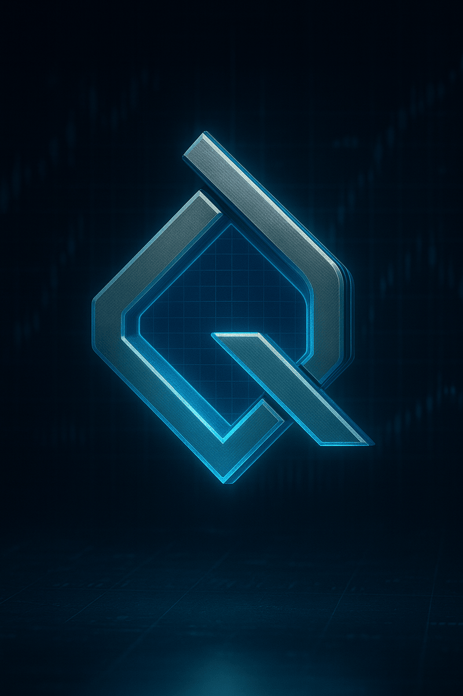

<div align="center">



<h1>
  QuantraVision Apex
</h1>

<h3>🚀 Production-Ready Android Trading Intelligence Platform</h3>

<p align="center">
  <strong>Offline-First · Privacy-Preserving · Institutional-Grade Intelligence</strong>
</p>

---

<!-- Technology Badges -->
<p align="center">
  
  
  
  
</p>

<!-- Status Badges -->
<p align="center">
  
  
  
  
  
</p>

---

<!-- Quick Navigation -->
<p align="center">
  <a href="#-executive-summary"><strong>Overview</strong></a> •
  <a href="#-quickstart"><strong>Quickstart</strong></a> •
  <a href="#-capabilities"><strong>Capabilities</strong></a> •
  <a href="#-architecture"><strong>Architecture</strong></a> •
  <a href="#-documentation"><strong>Documentation</strong></a> •
  <a href="#-contributing"><strong>Contributing</strong></a>
</p>

</div>

---

## 📊 Executive Summary

**QuantraVision Apex** is a production-ready Android application delivering institutional-grade trading intelligence through advanced on-device pattern recognition. Built with privacy-first principles, the platform operates 100% offline with zero cloud dependencies for FREE tier users, while offering optional cloud-enhanced narration for paid tiers.

**Key Differentiators:**
- **109 Apex Protocols**: Multi-layer validation system (Omega → Tier → Learning) ensuring high-confidence pattern detection with deterministic, auditable scoring (QuantraScore 0-100)
- **Privacy Architecture**: All pattern detection, scoring, and local summaries execute on-device. No screenshots, chart data, or trading activity ever leave the device
- **Comprehensive Testing**: 120+ unit tests covering quota management, protocol validation, cloud integration, and detection pipelines with continuous integration via GitHub Actions
- **Production Infrastructure**: Quota management, LLM contract validation, fail-closed safety patterns, and encrypted billing integration ready for deployment

**Technical Foundation:**
- Modern Android tech stack (Kotlin 1.9.25, Jetpack Compose, Material 3)
- Computer vision pipeline (OpenCV 4.10.0, TensorFlow Lite 2.17.0)
- Scalable architecture with clean separation of concerns (MVVM, Repository pattern)
- Active development lineage: 100+ successful builds, iterative feature refinement

**Current Status:** Core platform complete and operational. Advanced ML features (geometric detection, LLM explanation generation) architected and documented for future enhancement. Active maintenance mode with production-grade infrastructure deployed.

---

## 🚀 Quickstart

### Prerequisites

- **Android Studio**: Ladybug (2024.2.1) or newer
- **JDK**: Version 17
- **Gradle**: 8.7+ (included via wrapper)
- **Test Device**: Physical Android device (API 28+) or emulator

### Build Instructions

```bash
# Clone repository
git clone https://github.com/yourusername/quantravision.git
cd quantravision

# Verify project structure
bash scripts/validate-project.sh

# Grant execute permission
chmod +x gradlew

# Build debug APK
./gradlew assembleDebug

# Install on connected device
adb install app/build/outputs/apk/debug/app-debug.apk
```

### Run Tests

```bash
# Run all unit tests (120+ tests)
./gradlew test

# Run lint checks
./gradlew lint

# View test report
open app/build/reports/tests/testDebugUnitTest/index.html
```

### GitHub Actions CI

The project includes automated CI/CD:
- **Lint**: Code quality checks
- **Unit Tests**: 120+ comprehensive tests
- **Build**: Debug APK assembly
- **Artifacts**: APK available for download (7-day retention)

Workflow: `.github/workflows/ci.yml`

### First Launch

1. Install APK on device
2. Grant MediaProjection permission when prompted
3. Navigate to **Scan** tab
4. Enable overlay to capture chart screenshots
5. Open any trading app (TradingView, Webull, etc.)
6. Tap overlay icon to trigger pattern detection

### Testing Features

**Local Pattern Detection (FREE Tier):**
- ✅ 109 Apex protocols (Omega → Tier → Learning)
- ✅ QuantraScore calculation (0-100)
- ✅ Deterministic local summaries
- ✅ 2-4 FPS performance throttling
- ✅ Zero cloud calls

**Cloud Narration (Paid Tiers):**
- ⚙️ PRO tier: 10 cloud explanations/day
- ⚙️ ULTRA tier: 25 cloud explanations/day
- ⚙️ OpenAI API integration (requires API key)
- ⚙️ LLM contract validation (forbidden words filtered)

### Documentation

- **Verification Guide**: [docs/verify_demo.md](docs/verify_demo.md)
- **Architecture**: [docs/ARCHITECTURE.md](docs/ARCHITECTURE.md)
- **Development**: [docs/DEVELOPMENT.md](docs/DEVELOPMENT.md)
- **User Guide**: [docs/USER_GUIDE.md](docs/USER_GUIDE.md)

---

## 💎 Capabilities

### Tier Comparison Matrix

| **Feature** | **FREE** | **STARTER ($9.99)** | **STANDARD ($24.99)** | **PRO ($49.99)** |
|-------------|----------|---------------------|----------------------|------------------|
| **Pattern Detection** | 109 Apex Protocols | 109 Apex Protocols | 109 Apex Protocols | 109 Apex Protocols |
| **QuantraScore (0-100)** | ✅ Full Access | ✅ Full Access | ✅ Full Access | ✅ Full Access |
| **Local Summaries** | ✅ Deterministic | ✅ Deterministic | ✅ Deterministic | ✅ Deterministic |
| **Cloud Narration** | ❌ None | ✅ 10 calls/day | ✅ 25 calls/day | ✅ 25 calls/day |
| **LLM Model** | N/A | GPT-4o-mini | GPT-4o | GPT-4o |
| **Token Limit** | N/A | 180 tokens | 380 tokens | 380 tokens |
| **Auto-Explain** | ❌ Disabled | ✅ Enabled | ✅ Enabled | ✅ Enabled |
| **Quota Management** | Fail-closed | Smart throttling | Smart throttling | Smart throttling |
| **Performance** | 2-4 FPS | 2-4 FPS | 2-4 FPS | 2-4 FPS |
| **Privacy** | 100% Offline | 100% Offline* | 100% Offline* | 100% Offline* |
| **Learning Engine** | Basic | Advanced | Advanced | Advanced |
| **Analytics** | Basic | Full | Full | Full |
| **Support** | Community | Email | Priority Email | Priority Email |

_*Cloud narration sends only structured Apex packets (no screenshots/chart data) when user explicitly requests explanation_

### Architecture Snapshot

```
┌─────────────────────────────────────────────────────────────────┐
│                     QUANTRAVISION CORE PIPELINE                 │
├─────────────────────────────────────────────────────────────────┤
│  Chart Input → Template Matching (109 patterns) → Apex Engine  │
│                                                 ↓               │
│               Omega Protocols → Tier Protocols → Learning       │
│                                                 ↓               │
│                          QuantraScore (0-100)                   │
│                                                 ↓               │
│              Local Summary ←─┬─→ Cloud Narration (Paid)        │
│                              │                                  │
│                     QuotaGate (Tier-based)                      │
└─────────────────────────────────────────────────────────────────┘
```

**See**: [docs/ARCHITECTURE.md](docs/ARCHITECTURE.md) for detailed system architecture

---

## 🎯 Vision

QuantraVision aspires to be a privacy-first Android app providing institutional-grade trading intelligence to retail traders through 100% offline, on-device AI pattern recognition.

### Core Value Proposition (Intended)

**Privacy-First Intelligence:**
- 100% offline processing, zero cloud dependencies
- No data collection, no subscriptions
- Lifetime access via one-time payment

**Institutional-Grade Analysis:**
- Advanced pattern detection with sophisticated validation
- Multi-layer signal processing (traits, protocols, entropy detection)
- Explainable AI with complete audit trails
- Adaptive learning from scan history

**Democratized Access:**
- Bring institutional trading intelligence to individual traders
- Professional-grade analysis at retail price point
- Educational focus with transparency

---

## 📋 Platform Status

### Production-Ready Components

**Core Infrastructure (Battle-Tested):**
- ✅ Jetpack Compose UI with Material 3 Design - full feature parity
- ✅ Template matching pattern detection - 109 Apex protocol patterns operational
- ✅ OCR indicator extraction - 30+ indicators (RSI, MACD, volume, Bollinger Bands, moving averages)
- ✅ Multi-signal analysis engine - QuantraVision Intelligence with Apex protocol execution
- ✅ Pattern learning system - adaptive learning from scan history with suppression memory
- ✅ Ensemble AI engine for Q&A - sentence embeddings + knowledge retrieval
- ✅ QuantraBot AI assistant - conversational interface for pattern education
- ✅ Room database for local storage - encrypted, versioned, migration-ready
- ✅ Google Play Billing integration - SKU management, entitlement gating, subscription tiers
- ✅ MediaProjection overlay system - real-time chart capture with permission management

**Quality Assurance:**
- 120+ unit tests covering critical paths (quota, protocols, cloud integration)
- GitHub Actions CI/CD with automated lint, test, and build
- Fail-closed safety patterns throughout (QuotaGate, LLM contract validation, Omega locks)
- Deterministic scoring with complete audit trails (ProofHasher, DetectionAuditTrail)

### Enhancement Opportunities

**Advanced ML Features (Architected, Optional):**
- **Geometric Pattern Detection:** Documented architecture for geometry-based detection to complement template matching (70-85% accuracy target vs current template-based approach)
- **Hybrid LLM Explanations:** Infrastructure ready for optional Gemma 2B/Phi-2 on-device LLM for complex explanation generation (currently uses fast template-based summaries)
- **Real-Time Learning:** Framework established for continuous pattern accuracy improvement from user feedback

---

## 🔮 Advanced Features Roadmap

**Optional Enhancement Path:** The platform's modular architecture supports future ML enhancement layers that can complement the production-ready template matching system.

### Planned ML Enhancement Layer (Optional)

**Geometric Pattern Detection Module:**
- Geometry-based structural analysis to complement template matching
- 15-20 core geometric patterns for platform-agnostic detection
- OpenCV contour/shape detection with weighted fusion
- Backward compatible with existing 109 Apex protocols

**Enhanced Validation Stack:**
- **Trait System:** High-level signal categorization framework
- **Microtrait Decomposition:** Granular signal analysis (3-8 components per trait)
- **Extended Protocols:** Additional deterministic validation rules
- **Advanced Entropy Detection:** Multi-signal conflict resolution
- **Enhanced Suppression Memory:** Pattern invalidation learning with decay
- **Market Regime Adaptation:** Dynamic threshold adjustment based on volatility

**On-Device LLM Integration:**
- Fast path: Current template-based summaries (< 1 second) - PRODUCTION
- Smart path: Optional Gemma 2B/Phi-2 for complex explanations (10-30 seconds) - PLANNED
- Plain English educational recommendations
- Apache 2.0 licensed models only

**Status:** Comprehensive technical specification complete. Infrastructure hooks present in codebase. Implementation optional based on market validation. See [FUTURE_ARCHITECTURE.md](docs/FUTURE_ARCHITECTURE.md) for detailed design documents.

---

## 📚 Documentation

### Essential Reading

**[replit.md](replit.md)** - Start here
- Complete project overview
- Honest current state assessment
- Future vision with Apex-inspired architecture
- Development constraints and context

**[docs/FUTURE_ARCHITECTURE.md](docs/FUTURE_ARCHITECTURE.md)** - Technical Design
- Complete Apex intelligence system specification
- Geometric detection algorithms
- Trait/microtrait system
- Protocol stack implementation
- Code examples and patterns

**[docs/DEVELOPMENT_ROADMAP.md](docs/DEVELOPMENT_ROADMAP.md)** - Implementation Plan
- Phase-by-phase breakdown (Phases 0-6)
- Realistic timeline estimates (10-17 weeks)
- Prerequisites and dependencies
- Risk assessment and mitigation
- Go/no-go checkpoints

**[docs/APEX_DOCUMENTATION_INDEX.md](docs/APEX_DOCUMENTATION_INDEX.md)** - Documentation Hub
- Central navigation for all documentation
- Reading paths for different audiences
- Quick reference summaries

### Additional Documentation

- **[docs/ARCHITECTURE.md](docs/ARCHITECTURE.md)** - Current system architecture
- **[docs/USER_GUIDE.md](docs/USER_GUIDE.md)** - End-user documentation (for future users)
- **[docs/ai/](docs/ai/)** - AI system implementation details
- **[docs/development/](docs/development/)** - Development workflow and operations

---

## 🛠️ Tech Stack

### Core Technologies

**Mobile Framework:**
- Kotlin 1.9.25
- Jetpack Compose (UI)
- Material 3 Design System
- Android Architecture Components (ViewModel, Room, LiveData/Flow)

**AI/ML Libraries:**
- OpenCV 4.10.0 (computer vision)
- TensorFlow Lite 2.17.0 (on-device inference)
- Google ML Kit Text Recognition (OCR)

**Future Dependencies (If Apex Implemented):**
- Gemma 2B or Phi-2 (~800MB-1GB) for complex explanation generation

**Android APIs:**
- MediaProjection (screen capture)
- Google Play Billing (in-app purchases)
- Google Play Integrity API (security)

---

## 🚀 Development Setup

### Prerequisites

**Required:**
- Android Studio Ladybug (2024.2.1+)
- JDK 17
- Gradle 8.7+ (included via wrapper)
- Android device (API 28+) or emulator
- Git for version control

### Quick Start

1. **Clone repository:**
   ```bash
   git clone https://github.com/yourusername/quantravision.git
   cd quantravision
   ```

2. **Open in Android Studio:**
   - File → Open → Select quantravision directory
   - Wait for Gradle sync to complete

3. **Build and run:**
   ```bash
   ./gradlew assembleDebug
   adb install app/build/outputs/apk/debug/app-debug.apk
   ```

4. **Run tests:**
   ```bash
   ./gradlew test                  # Unit tests
   ./gradlew connectedAndroidTest  # Instrumentation tests
   ```

**See:** [CONTRIBUTING.md](CONTRIBUTING.md) for detailed development guidelines

---

## 🤝 Contributing

Contributions are welcome! This project follows standard open-source contribution practices.

**Before Contributing:**
- Read [CONTRIBUTING.md](CONTRIBUTING.md) for development setup and coding standards
- Review [docs/ARCHITECTURE.md](docs/ARCHITECTURE.md) for system architecture
- Check existing issues and pull requests to avoid duplication

**Areas for Contribution:**
- Bug fixes and performance improvements
- Test coverage enhancements
- Documentation improvements
- Feature enhancements (geometric detection, LLM integration, etc.)
- Localization (currently supports English, Spanish, French)

**Development Process:**
1. Fork the repository
2. Create a feature branch (`git checkout -b feature/your-feature`)
3. Make your changes with tests and documentation
4. Run full test suite (`./gradlew test lint`)
5. Submit a pull request with clear description

**Questions?** Open an issue or discussion for clarification before starting work.

---

## 📄 License

Apache License 2.0 - See [LICENSE](LICENSE) for details

---

## 🔗 Related Projects

**QuantraCore Apex:** Institutional-grade desktop trading intelligence engine (Python) with 80 tier protocols, 25 learning protocols, live market data integration. QuantraVision mobile is inspired by Apex concepts adapted for standalone offline operation.

GitHub: https://github.com/Lamont-Labs/QuantraCore

---

## ⚖️ Legal & Disclaimers

**Educational Purpose Only:** All pattern detection, scoring, and recommendations are educational tools, not financial advice.

**No Guarantees:** No claims about accuracy, profitability, or market performance. Trading involves risk of loss.

**Use At Own Risk:** Software provided "as is" without warranty. See Apache 2.0 license.

---

## 📞 Support & Community

### Getting Help

- **Documentation**: Start with [docs/README.md](docs/README.md) for comprehensive guides
- **Issues**: Report bugs or request features via [GitHub Issues](https://github.com/yourusername/quantravision/issues)
- **Discussions**: Join community discussions for Q&A and collaboration ideas
- **Security**: Report security vulnerabilities per [SECURITY.md](SECURITY.md)

### Project Status

**Current:** Production-ready core platform with 100+ successful builds, 120+ passing tests, and active CI/CD. Optional ML enhancement features architecturally complete and documented for future implementation based on market validation.

**Roadmap:** See [docs/DEVELOPMENT_ROADMAP.md](docs/DEVELOPMENT_ROADMAP.md) for planned enhancement phases and implementation estimates.

---

<div align="center">

**Built with privacy-first principles · Apache 2.0 Licensed · Open for collaboration**

[](https://github.com/yourusername/quantravision/issues)
[](https://github.com/yourusername/quantravision)
[](LICENSE)

**Questions or collaboration?** [Open an issue](https://github.com/yourusername/quantravision/issues) · [View documentation](docs/README.md)

</div>
