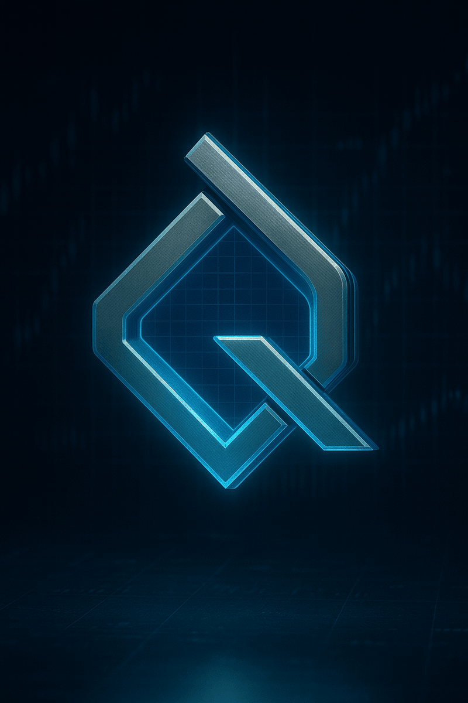

# QuantraVision Visual Guide

<div align="center">

**📸 Complete Visual Tour of QuantraVision**

*Experience professional pattern detection through stunning screenshots and feature demonstrations*

[](https://m3.material.io/)
[](https://developer.android.com/jetpack/compose)
[](#accessibility)

</div>

---

## 📋 Table of Contents

- [App Icon & Branding](#-app-icon--branding)
- [Onboarding Experience](#-onboarding-experience)
- [Main Dashboard](#-main-dashboard)
- [Pattern Detection Overlay](#-pattern-detection-overlay)
- [Intelligence Stack Features](#-intelligence-stack-features)
- [AI Learning Analytics](#-ai-learning-analytics)
- [Education System](#-education-system)
- [Settings & Customization](#-settings--customization)
- [Gamification](#-gamification)
- [Dark Mode](#-dark-mode)
- [Accessibility Features](#-accessibility-features)

---

## 🎨 App Icon & Branding

### Logo Design

<div align="center">



**Professional Gradient Design** - Blue/Purple gradient representing technical analysis and AI intelligence

</div>

### App Icon Variants

| Size | Platform | Preview |
|------|----------|---------|
| **512x512** | Google Play Store | High-resolution icon with shadow |
| **192x192** | Android Launcher | Adaptive icon (foreground + background) |
| **96x96** | Notification Icon | Simplified monochrome version |
| **48x48** | Status Bar | Ultra-compact notification badge |

### Color Palette

```kotlin
// Material 3 Theme Colors
val QuantraBlue = Color(0xFF00B4D8)        // Primary
val QuantraPurple = Color(0xFF6C63FF)      // Secondary
val QuantraGold = Color(0xFFFFD700)        // Accent (Pro tier)
val QuantraGreen = Color(0xFF4CAF50)       // Bullish patterns
val QuantraRed = Color(0xFFE74C3C)         // Bearish patterns
val QuantraBackground = Color(0xFF121212)  // Dark mode background
```

---

## 🚀 Onboarding Experience

### Welcome Screen (First Launch)

**Visual Highlights:**
- Animated logo reveal (fade-in + scale)
- Tagline: "AI-Powered Pattern Detection for Professional Traders"
- 3 key value propositions with icons:
  - 🧠 "102 Patterns Detected"
  - 🔒 "100% Offline Privacy"
  - 💰 "No Subscriptions Ever"

**Call to Action:**
- "Get Started" button (gradient blue → purple)
- "Skip to Free Tier" link (subtle)

---

### Permissions Screen

**Required Permissions:**
1. **Overlay Permission** ⭐ (Critical)
   - Icon: Floating overlay preview
   - Explanation: "QuantraVision overlays pattern highlights on your trading charts"
   - Visual: Mini demo showing overlay in action
   
2. **Storage Permission** (Optional)
   - Icon: PDF export symbol
   - Explanation: "Save pattern reports as PDFs to your device"

**Design Pattern:**
- Clear "Why we need this" explanations
- Android system permission dialogs styled to match app theme
- Progress indicator: "Step 1 of 2"

---

### Feature Tour (Interactive Tutorial)

**5 Carousel Slides:**

**Slide 1: Detection Power**
- Screenshot: Head & Shoulders pattern detected on TradingView
- Overlay: Glowing border + pattern label
- Caption: "Detect 102 patterns with AI precision"

**Slide 2: Intelligence Stack**
- Screenshot: Regime Navigator showing "High Probability - Strong Trend"
- Caption: "Know WHEN to trade with market condition analysis"

**Slide 3: Voice Alerts**
- Illustration: Phone with sound waves
- Caption: "Hands-free alerts: 'Head and Shoulders forming - 85% confidence'"

**Slide 4: AI Learning**
- Chart: Performance dashboard with upward trend
- Caption: "Gets smarter as you trade - 10 learning algorithms"

**Slide 5: Gamification**
- Achievement badges unlocking animation
- Caption: "Track progress with 15 achievements and daily streaks"

---

## 📊 Main Dashboard

### Dashboard Layout

```
┌────────────────────────────────────────────────┐
│  [☰ Menu]  QuantraVision  [⚙️ Settings]       │
├────────────────────────────────────────────────┤
│                                                 │
│  Welcome Back, Trader! 👋                      │
│  Today: Nov 2, 2025                            │
│                                                 │
│  ┌──────────────────────────────────────────┐ │
│  │    Quick Stats                            │ │
│  │  ┌─────────┐ ┌─────────┐ ┌─────────┐    │ │
│  │  │ Scans   │ │Patterns │ │ Streak  │    │ │
│  │  │   47    │ │   142   │ │   7d    │    │ │
│  │  └─────────┘ └─────────┘ └─────────┘    │ │
│  └──────────────────────────────────────────┘ │
│                                                 │
│  ┌──────────────────────────────────────────┐ │
│  │    Recent Detections                      │ │
│  │  ┌────────────────────────────────────┐  │ │
│  │  │ 🟢 Head & Shoulders (92%)          │  │ │
│  │  │    TradingView • 2m ago             │  │ │
│  │  └────────────────────────────────────┘  │ │
│  │  ┌────────────────────────────────────┐  │ │
│  │  │ 🔴 Double Top (78%)                │  │ │
│  │  │    Robinhood • 15m ago              │  │ │
│  │  └────────────────────────────────────┘  │ │
│  └──────────────────────────────────────────┘ │
│                                                 │
│  [🎯 Start Detection]  [📊 Analytics]         │
│                                                 │
└────────────────────────────────────────────────┘
```

**Visual Elements:**
- **Header Gradient**: Subtle blue → purple gradient
- **Quick Stats Cards**: Material 3 elevated cards with icons
- **Recent Detections**: List with pattern icons, confidence bars, timestamps
- **FAB (Floating Action Button)**: Large "Start Detection" button (gradient)

**Animations:**
- Card entry: Staggered fade-in + slide-up
- Scan count: Number counter animation
- Streak flame: Pulsing animation when >7 days

---

## 🔍 Pattern Detection Overlay

### Minimal Overlay Design

**Visual Components:**

1. **Floating Logo Button** (Draggable)
   - Size: 60dp x 60dp (default)
   - Position: Bottom-right corner
   - Appearance: QuantraVision logo with detection status ring
   - Badge: Pattern count (e.g., "3")
   - Opacity: 85% (customizable)

2. **Detection Status Ring**
   - **Idle**: Gray ring
   - **Scanning**: Animated blue ring (rotating)
   - **Patterns Found**: Green ring (pulsing)
   - **Error**: Red ring

3. **Pattern Highlights**
   - **Bounding Boxes**: Color-coded by bias
     - Bullish: Green (#4CAF50)
     - Bearish: Red (#E74C3C)
     - Neutral: Yellow (#FFC107)
   - **Line Width**: 3dp (crisp on all screen sizes)
   - **Corner Radius**: 4dp (rounded corners)
   - **Shadow**: 2dp elevation for depth

4. **Pattern Labels**
   - **Position**: Top-left of bounding box
   - **Background**: Semi-transparent badge (80% opacity)
   - **Text**: White, bold, 12sp
   - **Content**: Pattern name + confidence
   - **Example**: "H&S 92%"

5. **Confluence Zones** (Optional)
   - **Visualization**: Heatmap overlay
   - **Colors**: Blue (2 patterns) → Purple (3+) → Gold (5+)
   - **Opacity**: 30% (doesn't obscure chart)

### Customization Options

**Logo Size:**
- Small: 50dp
- Medium: 60dp (default)
- Large: 70dp

**Logo Opacity:**
- 50% (subtle)
- 75% (balanced)
- 85% (default)
- 100% (fully opaque)

**Highlight Visibility:**
- Show bounding boxes: ON/OFF
- Show labels: ON/OFF
- Show confidence scores: ON/OFF
- Show confluence zones: ON/OFF

---

### Quick Actions Menu

**Expandable Menu (Tap Logo):**

```
┌────────────────────────┐
│ 🎯 Scan Now            │
│ 📊 Dashboard           │
│ 🔔 Alerts: ON          │
│ 📚 Learning Stats      │
│ ⚙️ Settings            │
│ ❌ Stop Detection      │
└────────────────────────┘
```

**Visual Design:**
- Material 3 bottom sheet
- Glass morphism effect (iOS-inspired)
- Haptic feedback on tap
- Smooth slide-up animation

---

## 🎯 Intelligence Stack Features

### 📊 Regime Navigator

**Visual Layout:**

```
┌──────────────────────────────────────────────────┐
│  Market Condition Analysis                       │
├──────────────────────────────────────────────────┤
│                                                   │
│  Current Regime:                                 │
│  🟢 STRONG TRENDING • LOW VOLATILITY             │
│                                                   │
│  ┌────────────────────────────────────────────┐ │
│  │  Volatility:  ▓▓▓░░░░░  (3/10)  CALM      │ │
│  │  Trend:       ▓▓▓▓▓▓▓▓  (8/10)  STRONG    │ │
│  │  Liquidity:   ▓▓▓▓▓░░░  (5/10)  MODERATE  │ │
│  └────────────────────────────────────────────┘ │
│                                                   │
│  Pattern Success Rates (This Regime):            │
│  ┌────────────────────────────────────────────┐ │
│  │  ✅ Head & Shoulders:  85% (Excellent)     │ │
│  │  ✅ Triangles:         78% (Good)          │ │
│  │  ⚠️  Flags:            62% (Fair)          │ │
│  └────────────────────────────────────────────┘ │
│                                                   │
│  Recommendation:                                 │
│  "High probability environment for H&S and       │
│   triangle patterns. Flags less reliable."       │
│                                                   │
└──────────────────────────────────────────────────┘
```

**Visual Elements:**
- **Regime Badge**: Large badge showing current market state
- **Progress Bars**: Animated fill from 0 to current value
- **Color Coding**: Green (favorable) → Yellow (neutral) → Red (unfavorable)
- **Educational Tooltips**: Tap icons for explanations

---

### 🎯 Pattern-to-Plan Engine

**Visual Layout:**

```
┌──────────────────────────────────────────────────┐
│  Educational Trade Scenario                      │
│  Head & Shoulders (92% Confidence)               │
├──────────────────────────────────────────────────┤
│                                                   │
│  📈 Entry Strategy:                              │
│  "Buy on neckline break at $152.30"              │
│  [Visual: Chart with entry arrow]                │
│                                                   │
│  🛡️ Risk Management:                             │
│  • Stop Loss: $149.80 (pattern invalidation)    │
│  • Take Profit: $157.50 (measured move)          │
│  • Risk:Reward = 1:2.0                           │
│                                                   │
│  📊 Position Sizing (Educational):               │
│  • Risk 1% of $10,000 portfolio = $100           │
│  • Risk per share: $2.50                         │
│  • Max shares: 40 shares                         │
│                                                   │
│  ⚠️ Disclaimer:                                  │
│  "Educational example only. Not financial        │
│   advice. Trade at your own risk."               │
│                                                   │
│  [📢 Hear Voice Scenario]  [📋 Copy to Clipboard]│
│                                                   │
└──────────────────────────────────────────────────┘
```

**Visual Elements:**
- **Chart Illustration**: Mini chart showing entry/exit points
- **Risk Visualization**: Green/red zones for profit/loss
- **Calculator Widget**: Interactive position sizing calculator
- **Voice Button**: TTS narration of scenario

---

### 🛡️ Behavioral Guardrails

**Visual Layout:**

```
┌──────────────────────────────────────────────────┐
│  Trading Discipline Coach                        │
├──────────────────────────────────────────────────┤
│                                                   │
│  Current Status:                                 │
│  🟡 CAUTION - 3 Patterns Viewed in 5 Minutes     │
│                                                   │
│  ┌────────────────────────────────────────────┐ │
│  │  🔥 Activity Score:  78/100 (Elevated)     │ │
│  │  ⏱️  Cool-Down Timer: 2:30 remaining       │ │
│  │  📉 Loss Streak:     0 (Green)             │ │
│  └────────────────────────────────────────────┘ │
│                                                   │
│  Coaching Message:                               │
│  "You're viewing patterns rapidly. Take a        │
│   breath and review your trading plan before     │
│   the next trade. Cool-down period active."      │
│                                                   │
│  [✅ Acknowledge]  [📚 View Trading Plan]        │
│                                                   │
└──────────────────────────────────────────────────┘
```

**Visual Elements:**
- **Status Badge**: Color-coded (Green/Yellow/Red)
- **Activity Gauge**: Circular progress indicator
- **Cool-Down Timer**: Animated countdown
- **Coaching Icon**: Friendly coach character (optional)

---

### 📦 Proof Capsules

**Visual Layout:**

```
┌──────────────────────────────────────────────────┐
│  Proof Capsule Generator                         │
├──────────────────────────────────────────────────┤
│                                                   │
│  [Screenshot of detected pattern]                │
│                                                   │
│  Pattern: Head & Shoulders                       │
│  Confidence: 92%                                 │
│  Timestamp: Nov 2, 2025 2:45:23 PM               │
│  Chart Hash: a7f3d...9b2c                        │
│                                                   │
│  Proof Signature (SHA-256):                      │
│  ┌────────────────────────────────────────────┐ │
│  │  7d4a9f2e1b8c3f...  [📋 Copy]             │ │
│  └────────────────────────────────────────────┘ │
│                                                   │
│  Share Options:                                  │
│  [📱 QR Code]  [✉️ Share]  [💾 Save PDF]         │
│                                                   │
│  ✅ Tamper-Proof • Verifiable • Shareable        │
│                                                   │
└──────────────────────────────────────────────────┘
```

**Visual Elements:**
- **Screenshot Preview**: Thumbnail of detected pattern
- **QR Code**: Encoded proof signature
- **Verification Checkmark**: Green checkmark for verified capsule
- **Share Sheet**: Android native share functionality

---

## 📈 AI Learning Analytics

### Learning Dashboard

```
┌──────────────────────────────────────────────────┐
│  Your Personalized AI Learning Profile           │
├──────────────────────────────────────────────────┤
│                                                   │
│  Total Scans:  📊 47                             │
│  Patterns Learned:  🧠 23/102                    │
│  Personalization Level:  ⭐⭐⭐⭐☆ (80%)          │
│                                                   │
│  ┌────────────────────────────────────────────┐ │
│  │  Top 3 Patterns for YOU:                   │ │
│  │  1. 🟢 Head & Shoulders (Win Rate: 85%)    │ │
│  │  2. 🟢 Ascending Triangle (Win Rate: 78%)  │ │
│  │  3. 🟡 Bull Flag (Win Rate: 65%)           │ │
│  └────────────────────────────────────────────┘ │
│                                                   │
│  Best Trading Time:                              │
│  ⏰ Tuesday 9:30 AM - 11:00 AM                   │
│  (35% better performance than average)           │
│                                                   │
│  Market Regime Insights:                         │
│  "Your performance is best in TRENDING markets   │
│   with LOW volatility. Consider avoiding         │
│   patterns during high volatility periods."      │
│                                                   │
│  [📊 View Full Report]  [📥 Export PDF]          │
│                                                   │
└──────────────────────────────────────────────────┘
```

**Visualizations:**
- **Win Rate Charts**: Horizontal bar charts (green/red)
- **Time Heatmap**: 7x24 grid showing best trading hours
- **Performance Trends**: Line graph showing improvement over time
- **Pattern Correlation Matrix**: Interactive heatmap

---

## 🎓 Education System

### Lesson Viewer

```
┌──────────────────────────────────────────────────┐
│  ← Back      Lesson 2: Head & Shoulders          │
├──────────────────────────────────────────────────┤
│                                                   │
│  [📸 Pattern Diagram with Annotations]           │
│                                                   │
│  The Head & Shoulders pattern is a reversal      │
│  formation that signals the end of an uptrend.   │
│                                                   │
│  Key Components:                                 │
│  • Left Shoulder: Initial peak                   │
│  • Head: Higher peak                             │
│  • Right Shoulder: Lower peak (symmetry)         │
│  • Neckline: Support connecting the lows         │
│                                                   │
│  Breakout Signal:                                │
│  Pattern confirms when price breaks below the    │
│  neckline with increased volume.                 │
│                                                   │
│  Target:  Measured move from head to neckline    │
│                                                   │
│  ┌────────────────────────────────────────────┐ │
│  │  ✅ Tip: Watch for volume confirmation!    │ │
│  └────────────────────────────────────────────┘ │
│                                                   │
│  Progress: █████████░░ 75%                       │
│                                                   │
│  [← Previous]        [Next: Quiz →]              │
│                                                   │
└──────────────────────────────────────────────────┘
```

**Visual Elements:**
- **Annotated Diagrams**: Hand-drawn style with arrows/labels
- **Progress Bar**: Shows completion percentage
- **Interactive Elements**: Tap diagrams to zoom
- **Code Snippets**: Syntax highlighted (if applicable)

---

### Quiz Interface

```
┌──────────────────────────────────────────────────┐
│  Quiz: Head & Shoulders                          │
│  Question 2 of 5                                 │
├──────────────────────────────────────────────────┤
│                                                   │
│  Which component of the H&S pattern is the       │
│  highest point?                                  │
│                                                   │
│  ○ A) Left Shoulder                              │
│  ● B) Head                                       │
│  ○ C) Right Shoulder                             │
│  ○ D) Neckline                                   │
│                                                   │
│  [Submit Answer]                                 │
│                                                   │
│  ━━━━━━━━━━━━━━━━━━━━━━━━━━━━━━━━━━━━━          │
│  Correct: 1/1    Time: 0:12                      │
│                                                   │
└──────────────────────────────────────────────────┘
```

**Visual Elements:**
- **Radio Buttons**: Material 3 styled
- **Feedback**: Instant green/red feedback on answer
- **Score Tracker**: Real-time correct answer count
- **Timer**: Optional (can be disabled)

---

### Trading Book Viewer

```
┌──────────────────────────────────────────────────┐
│  ← Library    "The Friendly Trader"              │
│              by Jesse J. Lamont                  │
├──────────────────────────────────────────────────┤
│                                                   │
│  Chapter 3: Reading the Charts                   │
│                                                   │
│  As you stand before the price chart, imagine    │
│  it as a battlefield. Each candle tells a        │
│  story of struggle between bulls and bears...    │
│                                                   │
│  [Book content with serif font for readability]  │
│                                                   │
│                                                   │
│  ┌────────────────────────────────────────────┐ │
│  │  💡 Key Takeaway:                          │ │
│  │  "Always confirm patterns with volume!"    │ │
│  └────────────────────────────────────────────┘ │
│                                                   │
│  ━━━━━━━━━━━━━━━━━━━━━━━━━━━━━━━━━━━━━          │
│  Page 47 of 156      [🔖 Bookmark]              │
│                                                   │
│  [← Previous]   [Contents]   [Next →]            │
│                                                   │
└──────────────────────────────────────────────────┘
```

**Visual Elements:**
- **Serif Font**: Easier reading (Merriweather or Georgia)
- **Sepia Mode**: Eye-friendly color scheme (optional)
- **Bookmarks**: Save favorite pages
- **Night Reading Mode**: Dark theme with warm tones

---

## ⚙️ Settings & Customization

### Settings Screen

```
┌──────────────────────────────────────────────────┐
│  ← Back              Settings                    │
├──────────────────────────────────────────────────┤
│                                                   │
│  Detection                                       │
│  ┌────────────────────────────────────────────┐ │
│  │  Pattern Filters         [Manage →]        │ │
│  │  Confidence Threshold    [70% →]           │ │
│  │  Timeframe Preferences   [All →]           │ │
│  └────────────────────────────────────────────┘ │
│                                                   │
│  Overlay                                         │
│  ┌────────────────────────────────────────────┐ │
│  │  Logo Size               [Medium →]        │ │
│  │  Logo Opacity            [85% →]           │ │
│  │  Show Confidence         [✓ ON]            │ │
│  │  Show Confluence Zones   [✓ ON]            │ │
│  └────────────────────────────────────────────┘ │
│                                                   │
│  Alerts                                          │
│  ┌────────────────────────────────────────────┐ │
│  │  Voice Announcements     [✓ ON]            │ │
│  │  Haptic Feedback         [✓ ON]            │ │
│  │  High Confidence Only    [✓ ON]            │ │
│  └────────────────────────────────────────────┘ │
│                                                   │
│  Appearance                                      │
│  ┌────────────────────────────────────────────┐ │
│  │  Theme                   [Dark Mode →]     │ │
│  │  Language                [English →]       │ │
│  └────────────────────────────────────────────┘ │
│                                                   │
│  About                                           │
│  ┌────────────────────────────────────────────┐ │
│  │  Version                 [1.0.0]           │ │
│  │  Privacy Policy          [View →]          │ │
│  │  Terms of Use            [View →]          │ │
│  │  Export Debug Logs       [Export →]        │ │
│  └────────────────────────────────────────────┘ │
│                                                   │
└──────────────────────────────────────────────────┘
```

**Visual Elements:**
- **Grouped Settings**: Logical categorization
- **Material 3 Switches**: Animated toggle switches
- **Sliders**: For continuous values (opacity, threshold)
- **Navigation Arrows**: Indicate sub-screens

---

## 🏆 Gamification

### Achievements Screen

```
┌──────────────────────────────────────────────────┐
│  ← Back          Achievements                    │
├──────────────────────────────────────────────────┤
│                                                   │
│  12 of 15 Unlocked                               │
│  Progress: █████████████░░ 80%                   │
│                                                   │
│  ✅ First Detection                              │
│     "Detected your first pattern!"               │
│     Unlocked: Nov 1, 2025                        │
│                                                   │
│  ✅ Pattern Master (10)                          │
│     "Detected 10 unique pattern types"           │
│     Unlocked: Nov 2, 2025                        │
│                                                   │
│  🔒 Pattern Master (25)                          │
│     "Detect 25 unique pattern types"             │
│     Progress: 10/25 (40%)                        │
│     ████░░░░░░                                   │
│                                                   │
│  ✅ 7-Day Streak                                 │
│     "Scanned patterns for 7 days straight"       │
│     Unlocked: Nov 2, 2025                        │
│                                                   │
│  🔒 30-Day Streak                                │
│     "Scan patterns for 30 consecutive days"      │
│     Progress: 7/30 (23%)                         │
│     ██░░░░░░░░                                   │
│                                                   │
│  ✅ Accuracy 80%                                 │
│     "Maintained 80% pattern accuracy"            │
│     Unlocked: Nov 2, 2025                        │
│                                                   │
│  [Share Achievements]                            │
│                                                   │
└──────────────────────────────────────────────────┘
```

**Visual Elements:**
- **Badge Icons**: Custom-designed achievement badges
- **Unlock Animations**: Confetti explosion on unlock
- **Progress Bars**: Showing progress to locked achievements
- **Share Button**: Social media sharing

---

## 🌙 Dark Mode

### Dark Theme Palette

```kotlin
// Dark Theme Colors
val DarkBackground = Color(0xFF121212)
val DarkSurface = Color(0xFF1E1E1E)
val DarkSurfaceVariant = Color(0xFF2C2C2C)
val DarkOnSurface = Color(0xFFE0E0E0)
val DarkPrimary = Color(0xFF90CAF9)
val DarkSecondary = Color(0xFFCE93D8)
```

**Visual Comparison:**

| Screen | Light Mode | Dark Mode |
|--------|------------|-----------|
| **Dashboard** | White background, blue accent | Dark gray (#121212), lighter blue accent |
| **Pattern Card** | White card, dark text | Dark surface (#1E1E1E), light text |
| **Overlay** | Semi-transparent white | Semi-transparent dark |

---

## ♿ Accessibility Features

### Accessibility Checklist

✅ **Color Contrast:** All text meets WCAG AAA standards (7:1 contrast ratio)
✅ **Screen Reader Support:** Full TalkBack/VoiceOver compatibility
✅ **Touch Targets:** Minimum 48dp x 48dp (Material guidelines)
✅ **Captions:** Voice announcements have text equivalents
✅ **Reduced Motion:** Respects system animation settings
✅ **Large Text:** Supports Android font scaling up to 200%

**Visual Indicators:**
- **High Contrast Mode**: Extra-bold text, increased contrast
- **Focus Indicators**: Clear blue outline on focused elements
- **Error States**: Icons + text (not color alone)

---

## 📱 Responsive Design

### Screen Size Adaptation

| Device | Layout |
|--------|--------|
| **Phone (< 600dp)** | Single column, stacked cards |
| **Tablet (> 600dp)** | Two-column grid, side-by-side |
| **Foldable (expanded)** | Master-detail, multi-pane |

---

## 🎥 App Demo Video (Concept)

### 30-Second Demo Script

**0:00-0:05** - Logo reveal, tagline  
**0:05-0:10** - Show overlay on TradingView, pattern detected  
**0:10-0:15** - Voice alert: "Head and Shoulders forming..."  
**0:15-0:20** - Dashboard showing analytics, AI learning  
**0:20-0:25** - Education lesson viewer, quiz  
**0:25-0:30** - Call to action: "Download QuantraVision"  

---

<div align="center">

**Experience Professional Pattern Detection**

[](https://play.google.com)
[](https://quantravision.app)

*Screenshots and visuals represent the production version of QuantraVision v1.0.0*

</div>

---

## 📞 Feedback

Have suggestions for UI/UX improvements? [Open an issue](https://github.com/Lamont-Labs/QuantraVision/issues) or contact jesse@lamont.click.

---

<div align="center">

**QuantraVision** - Where AI Meets Beautiful Design

</div>
